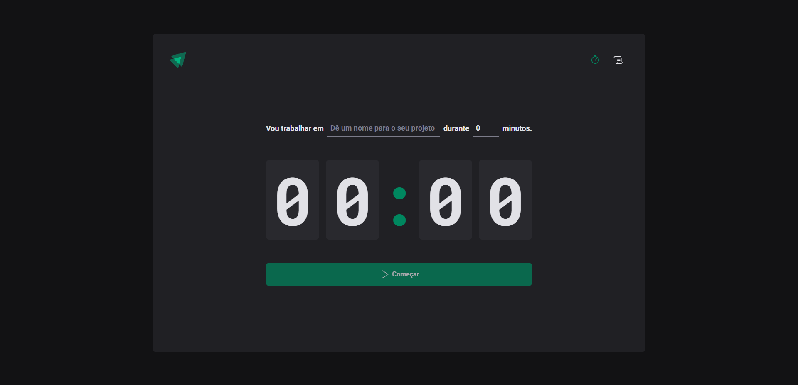
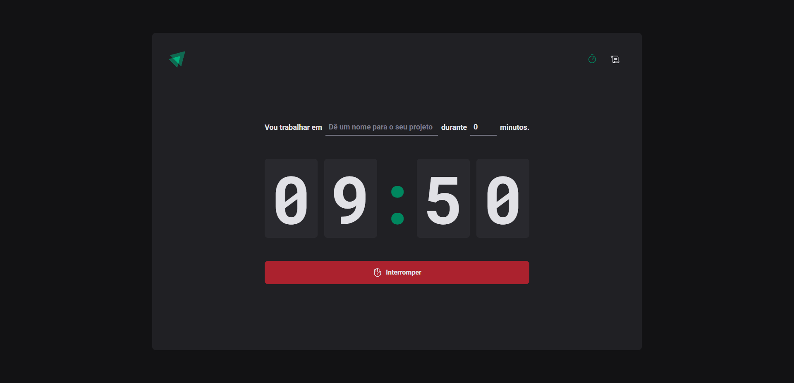
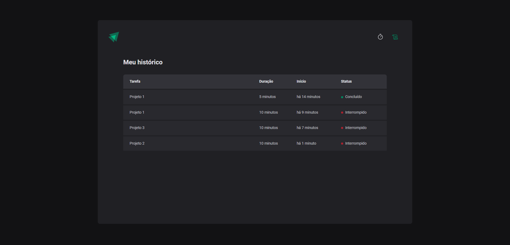

# Sobre o projeto
Projeto criado durante as aulas do Ignite, realizada pela Rocketseat.

A aplicação se trata de um timer utilizando a técnica de pomodoro, onde o usuário adiciona o nome do projeto ou trabalho que irá realizar e o tempo respectivo da tarefa, em sequinte a aplicação dispara esse tempo, até que esse tempo acabe. <br>
Há também uma tela de histórico, que lista essas tarefas e qual foi o status. Se foi concluída, em andamento ou interrompida.

### Tecnologias utilizadas no projeto
- React
- Vite
- typescript
- context api
- reducers
- styled-components
- ESLint
- react-router-dom
- react-hook-form
- zod
- immer

## Prints da aplicação:

<div>
    
    
    

</div>
 
### Como rodar o projeto.

Execute:
```bash
  npm install
```
and
```bash
  npm run dev
```
